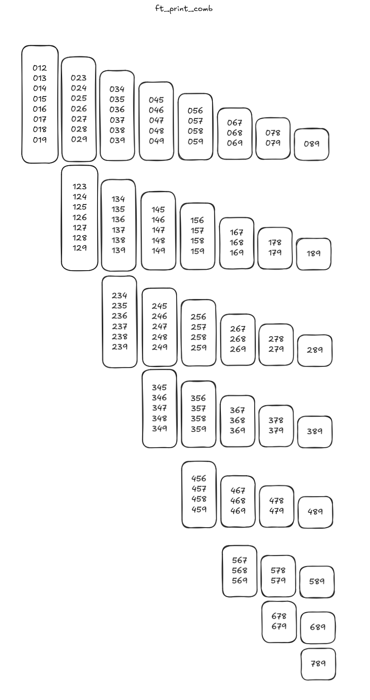

# C Piscine C00

## Before you start - IDE Setup

You can use any IDE you want, I chose VSCode because I am too lazy to set up Neovim lmao.

If you are also using VSCode I recommend at least these extensions:

- [**42 Header:**](https://marketplace.visualstudio.com/items?itemName=kube.42header) This let's you quickly insert the header you need to have in every C file you create by pressing CTRL+ALT+H. It also automatically fills in the Updated date when you save the file. Neovim has an equivalent config, I do not know what it was.
- [**C/C++ Extension Pack:**](https://marketplace.visualstudio.com/items?itemName=ms-vscode.cpptools-extension-pack) For syntax highlighting, auto suggestions and general checks. Not needed on Neovim, I think lazyvim comes with it installed already.
- [**42 Norminette:**](https://marketplace.visualstudio.com/items?itemName=MariusvanWijk-JoppeKoers.codam-norminette-3) This automatically checks your project for Norme errors while you're coding to avoid silly mistakes. For Neovim you can use the offical 42 `norminette` CLI, that can be easily installed using `pip`

## Required

### ex00. `ft_putchar`

You need the Unix Standard Library (`unistd.h`) included in your project to use the `write` function, this is allowed by the Moulinette throughout the entirety of C00.

If you need to see how a function works, you can look up it's corresponding POSIX man page using `man 3p [functionName]` (replace `[functionName]` with your function name, eg. `write`)

Here's the synopsis of `write`:

```c
       #include <unistd.h>

       ssize_t pwrite(int fildes, const void *buf, size_t nbyte,
           off_t offset);
       ssize_t write(int fildes, const void *buf, size_t nbyte);
```

You can safely ignore the confusing variable types for now, these will only be more relevant later. They're essentially integers.

To `write` to the console you need to set the `fildes` (File Descriptor) to 1 and set `nbytes` to how many bytes are in your `*buf`, so if you have one character, that is 1 byte as per ASCII.

Notice how `*buf` has the `*`, in C this means this is a pointer. You can also safely ignore this being there for now, but basically instead of an actual `char` or if you're coming from other languages that have `string` (which doesn't technically exist in C), it expects a memory address that points to the value we want.

So since we need to take the `char c` from our function `ft_putchar` we need to get it's address using the `&` operator:

`write(1, &c, 1);`

This might seem strange at first, but you'll get used to it after some time.

Since the function type is `void`, it doesn't actually `return` anything, which is fine.

Now finally to test if your code actually works, you should have a `main` function, this function of type `int` always runs first whenever a C program is ran. The reason it's of type `int` is because per POSIX, a program always returns an integer value that tells the shell or other programs whether the program encountered an error.

So make sure to `return (0);` which means success. The brackets are there to please `norminette`.

This is what this `main` function looks like:

```c
int main()
{
	ft_putchar('F');
	return (0);
}
```

Make sure to not use double quotes (`"`) as those are reserved for `char[]` (C equivalent of a string)

A `char` is not equal to a `char[]`

Then compile your C file using `gcc` as follows in Terminal:

```bash
gcc -Wall -Wextra -Werror ft_putchar.c
```

It will create `a.out` without any output if everything went correctly. This is an executable, you can run it in your terminal and it should output F

Congratulations, your first C code at 42! Read the C file in this repository for more help.

Remember that when you submit you should not include your `a.out` or `main` function. Remove these or at least comment out the `main` function before pushing to the Git repo.

### ex01: `ft_print_alphabet`

This function prints every character that is a lowercase character. And no you can't just manually type in every letter of course, that would be stupid.

Instead you have to think about how computers store data. Everything is digital.

So even characters are somehow mapped to specific numbers. Usually it's ASCII. This is a standard in computing that defines what number equals what character.

You can find ASCII tables online to see these numbers. But did you know that you don't even need to check what number each thing is? Instead, let's look at the pattern.

You can see that the lowercase letter 'a' is decimal number 97 in the ASCII table, followed up by lowercase letter 'b' which is decimal number 98.

In C, `char` is actually a number internally. So if you add +1 to a `char`, it jumps to the next one. You can even do number comparisons on them.

So technically all we need to do is while the character I'm on does not exceed the lowercase letter 'z', `write` and jump to the next (+1 on the `char`)

You can use a `while` loop to accomplish this easily. Check the C file to see how that looks in action. Once you know this, it should actually be straightforward how to do the remaining mandatory tasks!.. maybe except for `ex04`

### ex02: `ft_print_reverse_alphabet`

Same thing as `ex01` but instead of +1 we -1, and instead of checking if it exceeds, we check if it's lower than 'a'

### ex03: `ft_print_numbers`

Almost a 1:1 copy of `ft_print_alphabet` but with different start and end `char`s. Simple as that!

### ex04: `ft_is_negative`

This one is also very simple. We can use `if` to compare `n < 0`, if it is, its negative, otherwise using `else` we can assume it's positive.

## Optional

### ex05: `ft_print_comb`

Now this is where it gets trickier, and we need to think before we code.

The task is to print a combination of 3 digits at a time, seperated by a comma, and each of these 3 digits:

- cannot repeat
- cannot occur in the same group again in the next combination

This is the expected output:



I pseudo-coded using Python for loops as it's more readable for me:

```python
cout = ''
for a in range(8):
  for b in range(a, 9):
    for c in range(b, 10):
      if not (a == c or a == b or b == c):
        if not (a == 0 and b == 1 and c == 2):
          cout += ", "
        cout += f'{a}{b}{c}'
print(cout)
```

Basically how it works is there are 3 loops for each digit, the `a` loop contains the `b` loop which contains the `c` loop

Each loop starts from it's parent's current int or 0 for `a` to stop numbers like 021 to appear since we're raising the floor for it.

This way, `c` loop will run for the `c` digit which runs most of the times. when `c` loop runs out of digits, the `b` loop iterates and so the `c` loop is reset, just like how numbers overflow, aaand finally it cascades to `a` which is the slowest gear.

Then we just instruct `c` to print `abc` if `a`, `b` and `c` are not equal to each other

The reason I chose 8, 9 and 10 is because Python's `range()` function ends as soon as it sees the number it was given, if I did 7, 8 and 9 it would stop one number too early.

But we are not working with Python, and we are not allowed to use `for` loops as per Norme, so I created:

- `ft_print_digits`: a function which turns 3 `int` digits into their corresponding `char` ASCII representation and then prints them in order and calls `ft_print_comma` if neccesary.
- `ft_print_comb`: the function that houses our 3 nested `while` loops and `a`, `b` and `c` variables
- `ft_print_comma`: a function that just prints a comma for seperation.

You can see the code in the C file for it if you're completely helpless but this should be enough info so you can write it yourself, maybe look up syntax for the and/or operators, while loops and if statements in C.

### ex06: `ft_print_comb2`

This one was a bit more difficult than I anticipated. It would be a port of the one in `ex05` if it weren't for the 25 line limit for functions...

But the way I ended up doing it is by using some simple math

Basically I have only one `int` named `a` that grows from 1 all the way to 9899 (because that's the largest number where the first half is lower than the second half), and then to print it, I made a new `ft_print_digits` that derives `ca`, `cb`, `cc` and `cd` which are the `char` passed to `write` by doing:

```c
char ca
char cb
char cc
char cd

ca = '0' + (a / 1000) % 10
cb = '0' + (a / 100) % 10
cc = '0' + (a / 10) % 10
cd = '0' + (a) % 10
```

And then I was able to output them without issue, I just needed to use `write` constantly and add a space in between `cb` and `cc` and a comma after `cd` if `a < 9899` since that's the final number.

Then all my loop does is it gets the left half of `a` by dividing it by 100 and the right half using `a` modulo 100, checks if left is smaller than right before printing it because left cannot be larger than right, and that's it.

### ex07: `ft_putnbr`

I solved this one through recursion.

Basically when the function is first run, it checks if the number entered is -2147483648 because this is the overflow point for `int`, so it would cause unintended behavior if we try to calculate it. For this special case number we manually do the `write`.

If it is not, then we go on to check if the number is negative, and if it is we need to put a dash so it shows up as negative, then we set `nb = -nb` which basically makes it positive so we can work with it, otherwise the algorithm will fail.

Then if the number only has 1 digit (more or equal to 0 and less than 10) we can easily reuse `ft_putchar` again to output that. Otherwise, we will call `ft_putnbr` again, this time dividing `nb` by 10 so we remove the rightmost digit and do the same procedure on top of it again, and this keeps repeating until we only have one digit we can output using `ft_putchar`. Then after all these recursive operations, it does the same but this time using the `%` operator, which does the opposite of division by 10: it removes the leftmost digit. And this way, both halves are eventually reduced to single characters that can be outputted using `ft_putchar`, leading to our number!

### ex08: `ft_print_combn`

The code is probably the most complicated, it consists of a recursive function to print digits (`ft_print_digits`), a validation function (`ft_isasc`), a helper to calculate the maximum boundary (`ft_max`), and the main `ft_print_combn`.

`ft_print_combn` first uses `ft_max` to dynamically build the exact maximum valid combination for `n`. For example, if `n=3`, it calculates `10-3` to start at `7` and loops up to `9`, building the integer `789`.

Then we calculate the exact starting number `a` based on `n` by looping from `0` to `n-1` (for `n=3`, it builds the integer `12`, representing `012`). The first valid number is printed immediately using `ft_print_digits` so we don't have to worry about a leading comma on the first iteration.

After printing the first number, we enter a `while` loop that increments `a` by 1 (`a++`) until it reaches our calculated maximum number.

Instead of trying to mathematically calculate jumps to skip invalid numbers, we pass `a` and `n` to `ft_isasc`. This function extracts the digits from right to left using the `%` operator and checks if every digit is strictly smaller than the one to its right. If the number is not strictly ascending (like 10) or repeats digits (like 11), `ft_isasc` returns 0 and the loop skips it.

If `ft_isasc` returns 1, we print a comma directly using `write` and then the valid digits using `ft_print_digits`. This cycle repeats until `a` hits our exact maximum bound.
